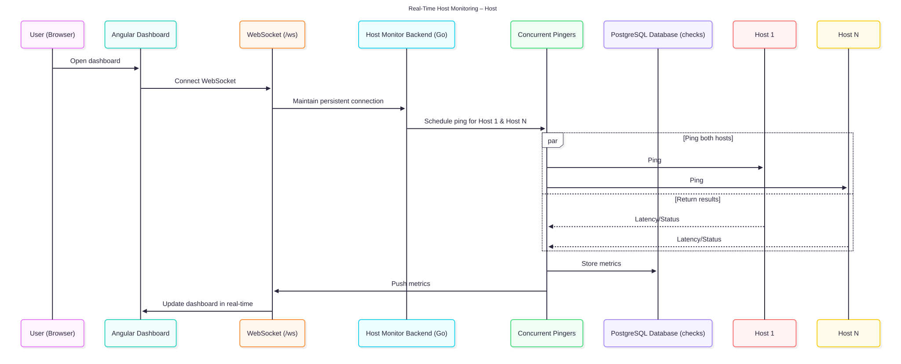
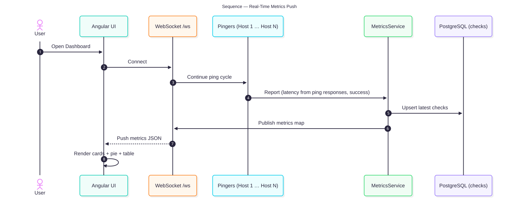
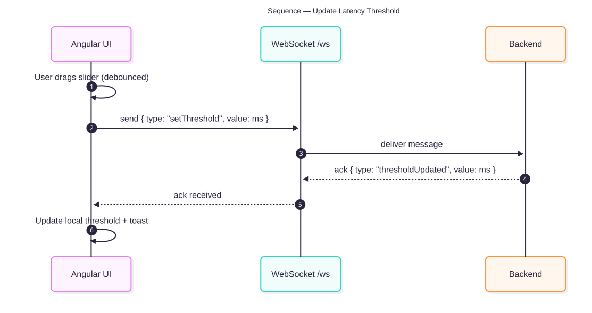

---

## title: Architecture

---

[⬅ Back to Home](./) | [Next → Usage](usage.md) | [→ Setup](setup.md)

---

# System Architecture

This page describes how Host Monitor is structured, how data flows through the system, and the key runtime behaviors.

## High‑Level Components



**What’s shown:** Angular UI, WebSocket server, Go services (`MonitorService`, `MetricsStore`), persistence (PostgreSQL), and core data models.

## Detailed Domain & Services



**What’s shown:** Method‑level view of domain models (`HostMetrics`, DTO), services (`MonitorService`, `MetricsStore`), settings/threshold API, and relationships.

## Runtime Flows

### Real‑Time Host Monitoring (Host 1 … Host N)



**Flow:** Browser → Angular Dashboard → WebSocket → Backend → Pingers → DB → WebSocket → UI.

### Metrics Push Loop



**Flow:** Pingers report → `MetricsService` aggregates → DB upsert → broadcast JSON over `/ws` → UI renders.

### Update Latency Threshold



**Flow:** UI slider (debounced) → send `{ setThreshold }` over `/ws` → backend acks and applies → UI toast.

## Connection Behavior

### WebSocket Reconnect & Backoff



**Strategy:** Exponential backoff (1s, 2s, 4s … max 30s). On reconnect, UI resubscribes and resumes live updates.

### Host Status State Machine


**Rules:**

* First success → **Up**
* Fail or latency > threshold → **Down**
* Success with latency ≤ threshold → **Up**

## Project Structure

The Host Monitor repository is organized into the following main components:

```
host-monitor
.
├── backend                 # Go backend service
│   ├── cmd                 # Entry points (CLI / main)
│   ├── deployments         # systemd, Docker, Kubernetes manifests
│   ├── internal            # Core app modules (config, services, handlers, models, utils)
│   ├── migrations          # SQL migrations for PostgreSQL
│   ├── pkg                 # Reusable packages (ping, websocket, etc.)
│   ├── scripts             # Helper scripts (e.g., ping-many.sh)
│   ├── web                 # Embedded Angular UI (production build)
│   ├── Dockerfile          # Backend container build
│   ├── go.mod / go.sum     # Go dependencies
│   ├── host-monitor        # Compiled binary (after build)
│   ├── Makefile            # Build/install tasks
│   └── README.md
├── docs                    # Documentation site
│   ├── diagrams            # Architecture, sequence, and flow diagrams
│   ├── images              # Screenshots and visuals for docs
│   ├── architecture.md     # This page
│   ├── future_improvements.md
│   ├── index.md
│   ├── maintenance.md
│   ├── overview.md
│   ├── setup.md
│   ├── tech.md
│   └── usage.md
├── ui                      # Angular frontend
│   ├── dist                # Production build output
│   ├── node_modules        # Frontend dependencies
│   ├── public              # Static assets
│   ├── src                 # Angular components, services, styles
│   ├── angular.json        # Angular CLI config
│   ├── Dockerfile          # UI container build
│   ├── package*.json       # NPM dependencies
│   ├── proxy.conf.json     # Dev proxy settings
│   ├── README.md
│   └── tsconfig*.json      # TypeScript configs
├── docker-compose.dev.yml  # Multi-container dev environment
└── README.md               # Root project overview
```

**Key conventions:**

* **backend/** contains the Go services, WebSocket server, metrics logic, and optional DB integration.
* **ui/** is the Angular SPA, served separately in dev and embedded in the backend in production.
* **docs/** is a MkDocs-style documentation site (the `.md` files you’re reading now).
* **scripts/** has helper and deployment scripts (kept untracked in some cases for local overrides).
* **deployments/** contains systemd, Docker Compose, and Kubernetes specs for easy deployment.

## Notes on Persistence

* Each check is written to `public.checks (host, up, latency_ms, packet_loss, checked_at)`.
* DB connectivity is optional for local/dev; when configured, events are persisted asynchronously.

---

[⬅ Back to Setup](setup.md) | [Next → Maintenance](maintenance.md)

---

<sub>© 2025 Host Monitor • <a href="https://github.com/BenjaminBatte/host-monitor">GitHub Repo</a></sub>
