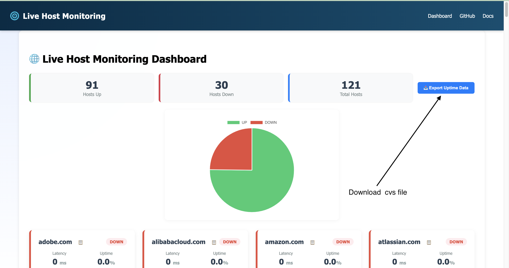

## [⬅ Back to Setup](setup.md) | [Next → Maintenance](maintenance.md)

## title: Usage

# Usage

Once the Host Monitor service is running:

* **Access the Dashboard:**
  Open the web dashboard in your browser (e.g., `http://localhost:4200` for dev or your deployed URL).

* **Real-Time Monitoring:**
  See host statuses, latency, packet loss, and uptime update instantly via WebSockets — no manual refresh needed.

* **Configure Hosts & Thresholds:**
  Use the **Settings Panel** to add/remove hosts or adjust the latency threshold. Changes are applied live without restarting the backend.

* **Visual Insights:**
  Review at-a-glance host status cards, uptime pie charts, and latency trend charts.

* **Export Data:**
  Use the **Export to CSV** button to download historical uptime and latency data for reporting or analysis.
  

* **Copy Details Quickly:**
  Click the copy-to-clipboard button on any host card to grab connection details instantly.

---

[⬅ Back to Setup](setup.md) | [Next → Maintenance](maintenance.md)
