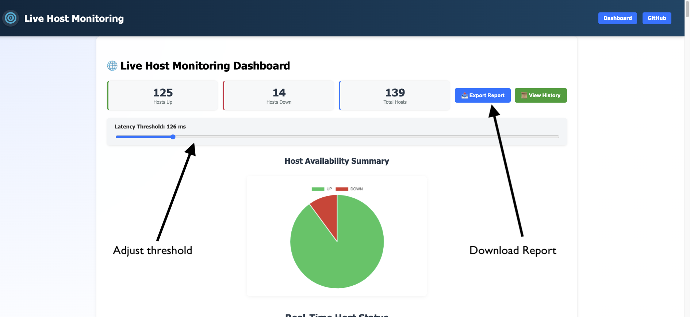
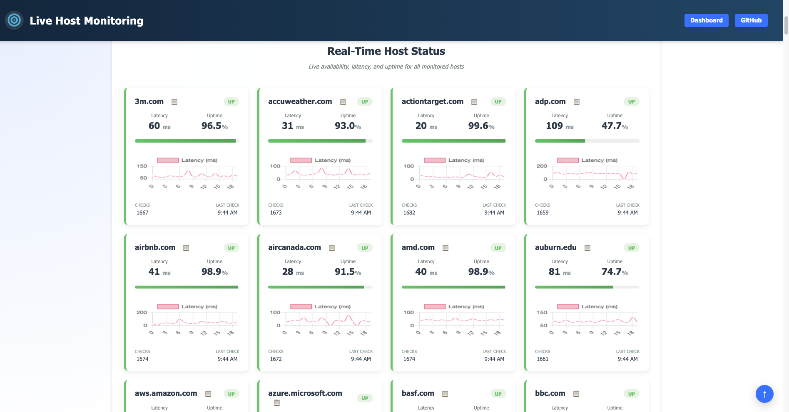
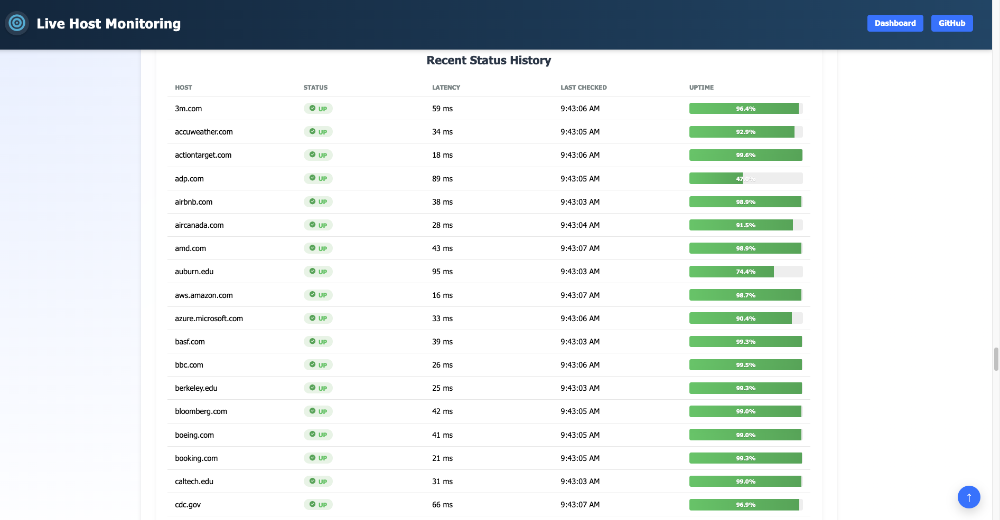

[⬅ Back to Setup](setup.md) | [Next → Maintenance](maintenance.md)

# Usage

Once the Host Monitor service is running:

## Access the Dashboard
Open the web dashboard in your browser (e.g., `http://localhost:4200` for development or your deployed URL).

## Real-Time Monitoring
View live host statuses with latency, packet loss, and uptime updated instantly via WebSockets — no manual refresh required.

## Configure Hosts & Thresholds
Use the **Settings Panel** to:
- Add or remove hosts
- Adjust the latency threshold  
Changes are applied immediately without restarting the backend.

## Visual Insights
At a glance, review host status cards, uptime distribution charts, and latency trend graphs.

## Export Data
Download historical uptime and latency metrics for reporting or analysis via the **Export to CSV** button.

## Copy Details Quickly
Click the copy-to-clipboard button on any host card to instantly copy its connection details.

---

## Recent Status History
See the latest checks with timestamps, status, latency, and uptime percentage — all in an easy-to-scan table.

---

[⬅ Back to Setup](setup.md) | [Next → Maintenance](maintenance.md)
