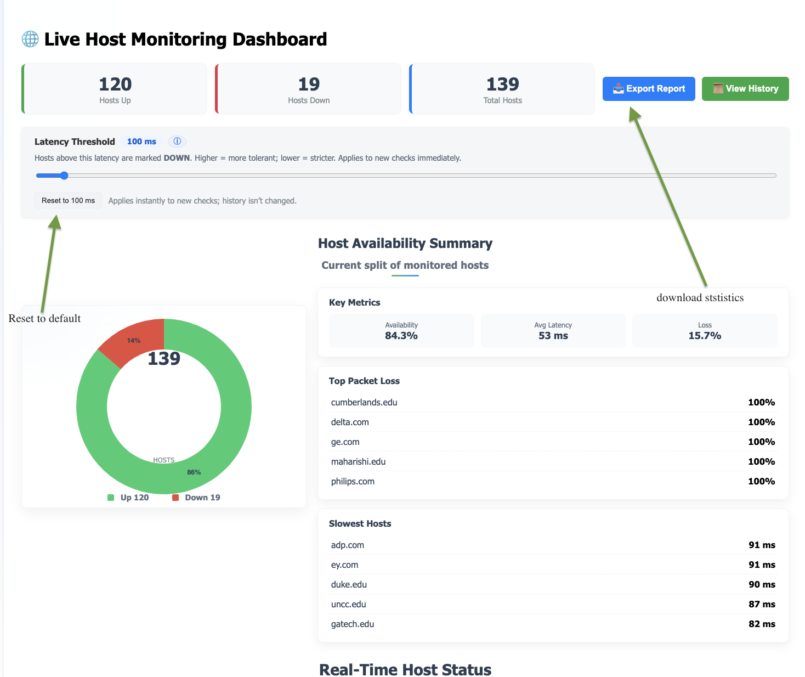
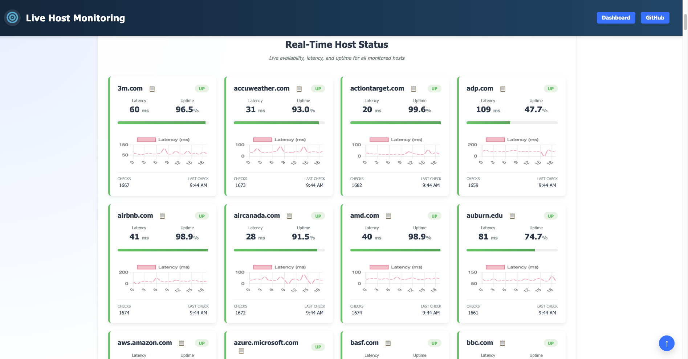
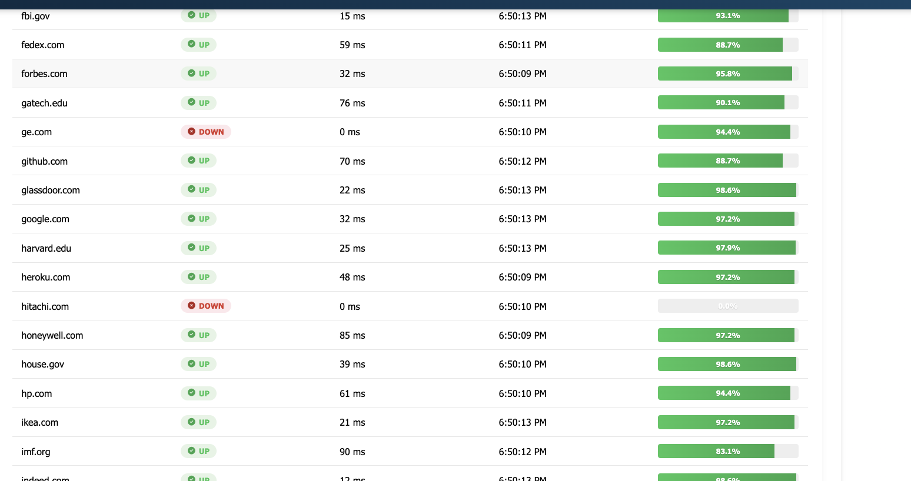
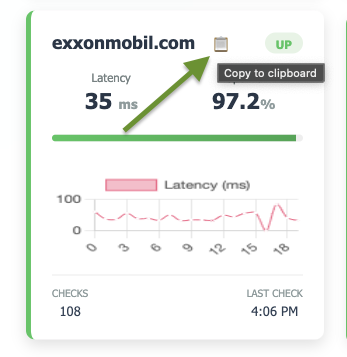

[⬅ Back to Home](./) | [Overview](overview.md) | [Architecture](architecture.md) | [Maintenance](maintenance.md) | [Technology Choices](tech.md) | [Future Improvements](future_improvements.md)

# Usage

Once the Host Monitor service is running:

## Access the Dashboard

Open the web dashboard in your browser:

* **Production (embedded UI):** `http://<server>:9090/`
* **Local development (Angular):** `http://localhost:4200/`

## Real-Time Monitoring

View live host statuses with latency and uptime updated instantly via WebSockets — no manual refresh required.

## Adjust Latency Threshold

Use the **Settings Panel** to:

* Adjust the latency threshold
* Click **Reset to 100 ms** to restore the default

Changes apply instantly to new checks without restarting the backend.

## Visual Insights

At a glance, review:

* **KPI cards:** Hosts Up, Hosts Down, Total Hosts
* **Donut chart:** Current split of monitored hosts
* **Key Metrics:** Availability, Avg Latency, Loss
* **Leaderboards:** *Top Packet Loss* and *Slowest Hosts*

## Export Report

Click **Export Report** to download current statistics (uptime, latency, loss) as a CSV for reporting or analysis.

## View History

Click **View History** to open a sortable table of recent checks with timestamps, status, latency, and loss.

## Quick Copy

Click the copy icon on any host card to instantly copy its connection details to the clipboard.

 [Architecture](architecture.md) | [Setup](setup.md) | [Maintenance](maintenance.md) | [Technology Choices](tech.md) | [Future Improvements](future_improvements.md)

© 2025 Host Monitor • <a href="https://github.com/BenjaminBatte/host-monitor">GitHub Repo</a>
